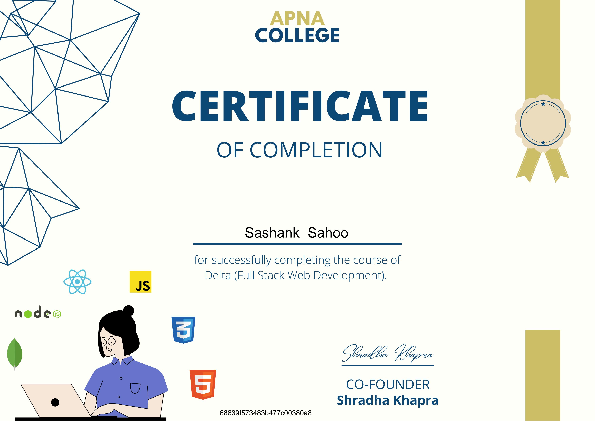
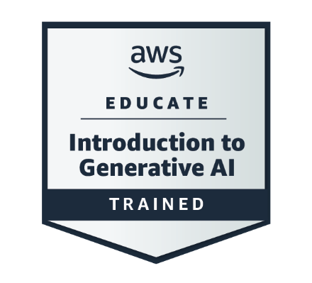

<h1 align="center">Hi 👋, I'm Sashank Sahoo</h1>

<h3 align="center">
Full Stack Developer • MERN Stack • AWS Cloud Learner • Future DevOps Engineer
</h3>

<p align="center">
Building scalable web applications while transitioning from
<strong>MERN Development</strong> to
<strong>AWS Cloud & DevOps</strong>.
</p>

---

## 🚀 About Me

- 🎓 MCA Student at GITA Autonomous College
- 💻 Passionate about Full Stack Web Development
- 🌱 Started my journey with the **MERN Stack**
- ☁️ Currently expanding into **AWS Cloud**
- ⚙️ Learning **Linux, Docker, CI/CD, Kubernetes and DevOps**
- 🎯 Goal: Build production-ready cloud-native applications

---

## 📚 Current Learning Journey

```text
HTML → CSS → JavaScript
            ↓
         React.js
            ↓
Node.js + Express.js
            ↓
        MongoDB
            ↓
      Full Stack MERN
            ↓
 Git & GitHub Workflow
            ↓
 AWS Cloud
            ↓
 Docker • CI/CD
            ↓
 Kubernetes
            ↓
 DevOps
```

---

## 🌐 Connect With Me

<p align="center">

<a href="https://www.linkedin.com/in/sashank-sahoo-282b5b2ab/">

</a>

</p>

---

## 💻 Tech Stack

### Frontend

<p align="center">


</p>

### Backend

<p align="center">


</p>

### Database

<p align="center">


</p>

### Cloud & DevOps

<p align="center">


</p>

---

## 📈 GitHub Analytics

<p align="center">


</p>

<p align="center">


</p>

---

<h1 align="center">Achivements 🏆</h1>

## Certificates

<table>
<tr>
<td>
<a href="./certificate-delta-60-681c81e906d252012a058bbf.pdf">

<br>
<b>MERN Internship Certificate</b>
</a>
</td>
</tr>
</table>

## Badges

<table>
<tr>
<td align="center">
<a href="https://www.credly.com/badges/a18eca58-c299-47b5-9fc6-dad58b0ed04b/linked_in?t=thmsli">
<br>
<b>AWS Cloud 101</b>
</a>
</td>

<td align="center">
<a href="https://www.credly.com/badges/a6ecd12e-dca6-4749-98ac-e4372cdfa4e7/linked_in?t=tg20mt">
<br>
<b>Generative Ai</b>
</a>
</td>
</tr>   
</table>
